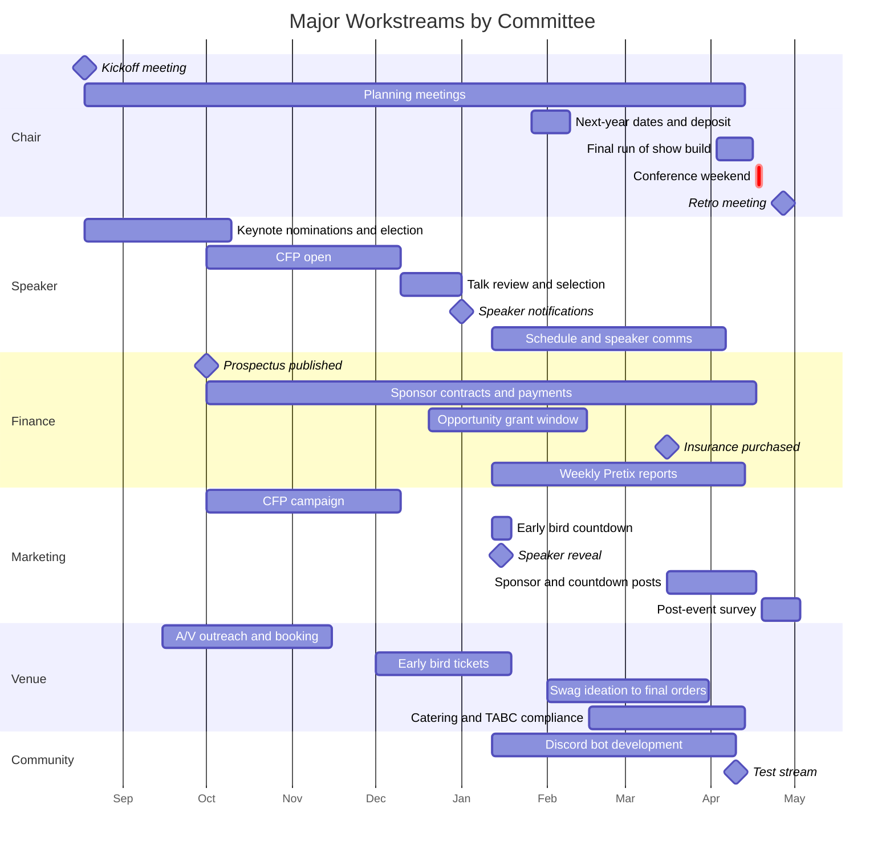

# Conference Master Timeline

Chronological checklist for the full conference cycle, from the previous conference through the post-event replay campaign.

Dates are conference-relative.
The conference is anchored at mid-April, so Month -8 is mid-August and Week -4.5 is mid-March.
Absolute dates in bold are real institutions (kickoff mid-August, CFP opens October 1) and move only if the anchor moves.
Committee tags: [Chair] [Speaker] [Finance] [Marketing] [Venue] [Community].

For detail on any item, see the topic and committee runbooks.

## The Cycle at a Glance

Previous Conference and HandoffMonths -13 to -9

KickoffMonth -8

CFP and Sponsorship SeasonMonths -7 to -5

Selection and TicketsMonths -4.5 to -3

Logistics SprintWeeks -12 to -5

Final WeeksWeeks -4.5 to -1

ConferenceMonth 0

Post-Event and ReplaysWeeks +1 to Month +7

Bars show a representative cycle.
Months assume a mid-April conference and shift with the actual date.

## Month -13 to -12: During and Just After the Previous Conference

- [ ] [Chair] Sign next year's facility use agreement immediately after the current conference and pay the 50% deposit at signing (14-day return deadline). See `next-year-planning.md`.
- [ ] [Finance] Create next year's budget sheet during the current conference weekend.
- [ ] [Chair] Start the retro doc within days of the event; it accumulates all year.
- [ ] [Marketing] Announce next year's dates at the current conference with a draft page; do not build the full site during the event itself.

## Month -12 to -9: Handoff and Branding

- [ ] [Marketing] Start logo work (~10 months out; the 2025 cycle had it done before kickoff). The logo blocks the website, prospectus, and swag.
- [ ] [Speaker] Recruit tutorial presenters in person, starting at PyCon US (~11 months out). Tutorials are invited directly, not part of the open CFP.
- [ ] [Chair] Refine the retro; carry action items into the new cycle.

## Month -8: Kickoff

**Kickoff is mid-August**, about 8 months out.
This is settled practice, three cycles running.

- [ ] [Chair] Hold the kickoff meeting: virtual, 45-minute target, hard 1-hour cutoff. See `kickoff-meeting.md`.
- [ ] [Chair] Assign committee leads via round-robin volunteer mapping; set annual goals (sell-out date, profit target, meeting discipline).
- [ ] [Chair] Stand up the year's Important Documents: minutes doc, Drive folder, budget sheet, retro doc.
- [ ] [Speaker] Open the keynote nomination form. See `keynote.md`.
- [ ] [Speaker] Set the CFP open date (**October 1**) as the cycle's first hard deadline.

## Month -7: September

- [ ] [Marketing] Build the year's marketing planning docs and campaign templates; onboard any new lead against last year's folders and the last two retros. See `onboarding-new-lead.md`.
- [ ] [Marketing] Get the year's website live before October 1 so the newsletter on the 1st can link it.
- [ ] [Venue] Start A/V vendor outreach. See `av.md`.
- [ ] [Finance] Finalize the sponsor prospectus for publication by early October, explicitly to hit corporate budget season. See `sponsorship.md`.
- [ ] [Chair] Draft the run of show skeleton with pitch slots before any sponsorship is sold, so pitch slots can be written into contracts. See `run-of-show.md`.
- [ ] [Speaker] Close keynote nominations end of September or early October.

## Month -6.5: October 1

- [ ] [Speaker] **CFP opens October 1** on Pretalx; it runs to early December. See `cfp.md`.
- [ ] [Finance] **Publish the sponsor prospectus** and email it to the sponsor mailing list.
- [ ] [Marketing] Run the CFP announcement campaign: one Mailchimp email, same-day posts across platforms, Canva assets in three sizes, CFP-writing help via Discord, listings on pythondeadlin.es and python.org events.
- [ ] [Speaker] Run the keynote organizer election (ranked ballot, +2 to -2 scoring).

## Month -5.5 to -5: Late October and November

- [ ] [Speaker] Decide the keynote invite order from the ranked list and work down it. The backup order matters; the 2026 keynoters were #2 and #5 on the list.
- [ ] [Finance] Clone per-tier sponsor agreement templates from last year.
- [ ] [Venue] Set the ticket timeline: early bird opens December 1, speaker list mid-January, early bird closes mid-to-late January. Start Pretix setup with demographic questions.
- [ ] [Venue] Request the A/V quote and book the vendor.
- [ ] [Venue] Amend the venue agreement if needed.
- [ ] [Marketing] Push a CFP reminder to Texas meetup lists mid-window.

## Month -4.5: December 1

- [ ] [Venue] **Early bird tickets open December 1** on Pretix, with caps by class and shirts sold as a pre-order add-on. See `registration.md`.
- [ ] [Speaker] **CFP closes early December.** Review over the holidays for at least two full weeks: voting in Pretalx, then an in-person decision meeting.
- [ ] [Finance] Open the opportunity grant application. See `grants.md`.
- [ ] [Speaker] Send the speaker information form to accepted speakers in mid-December, not a week before the event.
- [ ] [Finance] Have the sponsor invoice template ready.

## Month -3.5: Around January 1

- [ ] [Speaker] Send speaker notifications around the new year with a hard confirmation deadline (~2 weeks). Reject everything below the waitlist promptly; offer standbys free tickets.
- [ ] [Finance] Apply for the PSF grant about 3 months out. It requires a published schedule, CoC and policy links, and a budget, and carries an 8-week processing lead. External freezes happen without warning, so earlier is safer.

## Week -14 to -12: Mid-to-Late January

- [ ] [Speaker] Confirm the talk lineup and hold an ordered waitlist.
- [ ] [Finance] Pay the library invoice and the A/V deposit.
- [ ] [Finance] Start weekly Pretix accounting reports, filed every Monday until conference week.
- [ ] [Marketing] **Speaker reveal January 15**, with a teaser-then-reveal post pair per speaker across five platforms. Collect name, socials, and photo at acceptance, not later.
- [ ] [Venue] **Early bird ends around January 19**; run a countdown campaign the week before.
- [ ] [Chair] Choose next year's dates by conflict-checking the Austin events spreadsheet; target a signed next-year venue contract by February 1. See `next-year-planning.md`.
- [ ] [Marketing] Issue Friends of PyTexas coupon codes via Pretix.

## Week -11 to -9: Late January and Early February

- [ ] [Chair] Pay next year's venue deposit.
- [ ] [Speaker] Publish the schedule; confirm the tutorials.
- [ ] [Venue] Open the swag ideation docs (shirt ideas, other swag, speaker gifts) and the catering ideas doc with headcount assumptions. See `swag.md` and `catering.md`.
- [ ] [Venue] Gather catering, bartending, and swag quotes. Remind vendors that 501(c)(3) status removes sales tax.

## Week -8.5: Mid-February

- [ ] [Finance] **Opportunity grant applications close around Week -8.5.** Review them in a dedicated special meeting the next day, not the regular meeting.
- [ ] [Venue] Confirm catering deposits and headcounts; deposits run roughly half of totals.

## Week -7.5 to -6: Late February and Early March

- [ ] [Speaker] Present the proposed schedule; get Slido and StageTimer single-event quotes.
- [ ] [Venue] Pay the first swag order (patches, stickers, pins); pay both dinner-venue deposits.
- [ ] [Venue] Build the catering plan sheet: per-day blocks (breakfast, coffee, snacks, all-day beverages) plus a "who's getting what" shopping tab with an owner per item.
- [ ] [Venue] Submit the TABC permit for any alcohol service, and start the peace officer hire if not already running. 2026 filed the permit ~2.5 weeks out and it was still in review the day before; file it here instead. See `network-event.md`.
- [ ] [Finance] Chase remaining sponsor contracts; hold dependent orders behind sponsor payment (the lanyard order waits for the lanyard sponsor).

## Week -5.5 to -4.5: Mid-March

- [ ] [Finance] **Buy event insurance by Week -4.5** (The Event Helper). Hard deadline.
- [ ] [Venue] **Close shirt pre-orders around Week -5** with a last-chance campaign, then **place the shirt order immediately after, around Week -4.5**.
- [ ] [Venue] Confirm the licensed peace officer for alcohol service; hiring took a month of bounced emails in 2026, so this should already be in motion.
- [ ] [Venue] Place final catering orders; order linens (American Party Rental; reuse last year's invoice).
- [ ] [Finance/Marketing] Publish the Attendee KBYG and Sponsor KBYG; build the sponsor marketing sheet with an "Approved To Market?" gate. Unpaid sponsors never get a post.
- [ ] [Marketing] Prep sponsor thank-you campaigns per sponsor: one before, one during.

## Week -3.5 to -2.5: Late March

- [ ] [Marketing] Announce to Texas Python meetups on Meetup.com; run a website freshness pass (Speak section, sponsor page, what-to-bring page).
- [ ] [Venue] Have all swag ordered and approved.
- [ ] [Venue] Confirm the TABC permit is approved and in hand.
- [ ] [Venue] Finalize both dinner plans.

## Week -1.5 to -1: Final Two Weeks

- [ ] [Speaker] Send the speaker KBYG; open the slide-upload folder; collect technical-term lists for caption prep.
- [ ] [Community] Run a test stream at least one week ahead. See `discord.md`.
- [ ] [Venue] Print signage (~6 standing signs, 5-10 single-page; map it on a Miro board); check whether the venue has sign holders.
- [ ] [Venue] Order badges (ConferenceBadges.com). Badges slipped to the final two weeks in both 2025 and 2026; treat this as the latest acceptable moment, not the plan.
- [ ] [Venue] Collect dietary restrictions. 2026 did this the final week; do it earlier.
- [ ] [Marketing] Run daily sponsor countdown posts; build the per-day lightning talk signup forms; prepare the feedback form and organizer-interest form.
- [ ] [Finance] Chase final sponsor payments; this ran into conference week in both 2025 and 2026.

## Days -4 to -1: Conference Week

- [ ] [Chair] Finish the run of show grid. It was built 3-4 days out in every recorded year and every retro says earlier; target ~2 weeks out. See `run-of-show.md`.
- [ ] [Venue] Final catering plan updates; plan the Friday morning Costco and HEB run during the first tutorial.

## Conference Weekend

There is no Thursday venue access.
The contract covers three 13-hour days, Friday through Sunday, 6:00 AM to 7:00 PM.
Setup happens Friday morning in parallel with tutorials.
See `day-of-operations-guide.md` and `run-of-show.md`.

## Week +1 to +2: Post-Event

- [ ] [Community/Marketing] Launch the post-event survey on the last conference day; collect responses for about two weeks.
- [ ] [Speaker] Distribute per-speaker feedback from Slido and the feedback form.
- [ ] [Marketing] Export Buffer analytics; file photos.
- [ ] [Chair] Hold the retro meeting within two weeks; the retro doc has been accumulating all year. See `post-event.md`.
- [ ] [Finance] Pay the final A/V installment (due ~3.5 weeks after in 2025).

## Month +3 Onward: Replays

- [ ] [Marketing] Run the replay drip: one recorded talk per week, every Wednesday, starting ~13 weeks after the conference and running ~16 weeks, across five platforms with a GIF per talk.
- [ ] [Community] Get recordings onto pyvideo.org via a manual pull request to the pyvideo/data repo.
- [ ] [Marketing] Flip each YouTube video and the playlist from unlisted to public; the vendor delivers them unlisted.

## Critical Path

Long lead time or blocks other work:

1. Next-year venue contract: sign right after the current conference, deposit at signing.
2. Logo (Months -12 to -10): blocks the website, prospectus, and swag.
3. CFP opens October 1: the website must be live first.
4. Prospectus by early October: corporate budget season does not wait.
5. Run of show draft: a pitch-slot skeleton must exist before sponsorships are sold.
6. A/V vendor: outreach Month -7, booked by Month -6 to -5, deposit by Month -3.
7. Shirt pre-order close (~Week -5) and immediate order (~Week -4.5).
8. Badges: a recurring late item every year; order before the final two weeks.

## Budget Ranges (% of Total)

These shares are a planning heuristic carried over from earlier drafts of the runbooks, not derived from recorded actuals; treat them as starting points only.

- A/V: 20-25%
- Networking event: 15-18%
- Venue: 12-15%
- Catering: 8-12%
- Swag: 8-10%
- Opportunity grants: 3-5%
- Reserve: 10-15%

The recorded relative magnitudes differ from these shares.
In 2026, food and beverage was the largest expense category, happy hour / network event was second, and venue rental was the largest single line.
Where the shares and the record disagree, trust the record.

See `budget-planning-template.md`.

## Lessons Learned

- 2023-2026: the run of show was built 3-4 days out every year, and every retro says build it earlier. Keep the pitch-slot draft from Month -7 alive and finish the grid ~2 weeks out.
- 2025: the PSF grant freeze plus its 8-week processing lead forced a scramble. Apply earlier than feels necessary.
- 2025, 2026: badges slipped to the final two weeks both years.
- 2025, 2026: sponsor payment chasing ran into conference week both years. Sequence dependent orders behind payment.
- 2025: two sponsors never redeemed their comped tickets. Track redemption through the conference.
- 2026: TABC permit filed ~2.5 weeks out was still in review the day before, and the peace officer hire took a month of bounced emails. Start both months earlier.
- 2026: the sell-out-a-month-early goal failed; about a third of capacity had sold five weeks out. Ticket pushes need to start earlier and harder.
- 2026: coffee is the largest catering friction and budget overrun.
- 2026: collect speaker name, socials, and photo at acceptance; only 6 of ~15 had responded when marketing first checked.
- 2026: library pricing was flagged as doubling for 2027. Have the next-year contract signed by February 1.
- 2026: ordering ice online works; repeated store runs are the fallback restock mechanism and eat organizer time.
