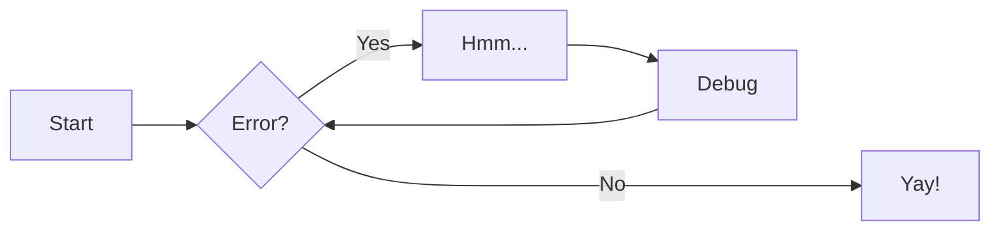
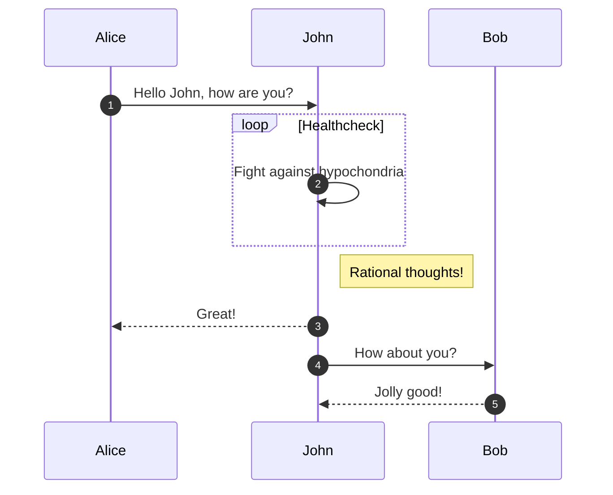

# Welcome to the PyTexas Conference Documentation

This site is built on [mkdocs](https://www.mkdocs.org) and uses
the [mkdocs-material](https://squidfunk.github.io/mkdocs-material/) theme.

We welcome contributions, however, since these are the runbooks used
for executing PyTexas, we reserve the right to reject PRs on the premise
that it is not how we do things.

If you are starting your own conference and want to use this as a
baseline for your operations feel free to fork!

## Prerequisites

This project uses modern Python tooling for development. You'll need to install:

1. **uv** - Fast Python package manager
    - Install: `curl -LsSf https://astral.sh/uv/install.sh | sh`
    - More info: [uv documentation](https://docs.astral.sh/uv/)
2. **just** - Command runner for project tasks
    - Install: `cargo install just` or `brew install just`
    - More info: [just documentation](https://just.systems/)
3. **lychee** (optional) - Link checker for documentation
    - Install: `cargo install lychee` or `brew install lychee`
    - More info: [lychee documentation](https://github.com/lycheeverse/lychee)
    - _If you don't install this, the CI will catch any broken links and fail the build._

## Developing Locally

1. Clone the repository and install dependencies:

    ```bash
    git clone https://github.com/pytexas/runbooks.git
    cd runbooks
    just install  # or: uv sync
    ```

2. Start the development server with hot reload:

    ```bash
    just serve  # or: uv run mkdocs serve
    ```

    The site will be available at http://localhost:8000

3. Build the static site:

    ```bash
    just build  # or: uv run mkdocs build
    ```

## Available Commands

Run `just help` to see all available commands:

- `just install` - Install all dependencies
- `just serve` - Start development server
- `just build` - Build static site
- `just validate` - Build with strict validation
- `just link-check` - Check all links
- `just check` - Run all quality checks
- `just clean` - Clean generated files

## Extended Markdown Guide
This guide uses a few `pymdownx` extensions to render various
web elemnts.

### Details

```markdown
??? success
    Content.

??? warning classes
    Content.

???+ note "Open styled details"

    ??? danger "Nested details!"
        And more content again.
```

??? success
    Content.

??? warning classes
    Content.

???+ note "Open styled details"

    ??? danger "Nested details!"
        And more content again.


### Tabbed

```markdown
=== "Tab 1"
    Markdown **content**.

    Multiple paragraphs.

=== "Tab 2"
    More Markdown **content**.

    - list item a
    - list item b
```   

=== "Tab 1"
    Markdown **content**.

    Multiple paragraphs.

=== "Tab 2"
    More Markdown **content**.

    - list item a
    - list item b

### Diagrams with Mermaid

#### Flow Chard
```markdown
graph LR
  A[Start] --> B{Error?};
  B -->|Yes| C[Hmm...];
  C --> D[Debug];
  D --> B;
  B ---->|No| E[Yay!];
```



#### Sequence Diagram

```markdown
sequenceDiagram
  autonumber
  Alice->>John: Hello John, how are you?
  loop Healthcheck
      John->>John: Fight against hypochondria
  end
  Note right of John: Rational thoughts!
  John-->>Alice: Great!
  John->>Bob: How about you?
  Bob-->>John: Jolly good!
```





