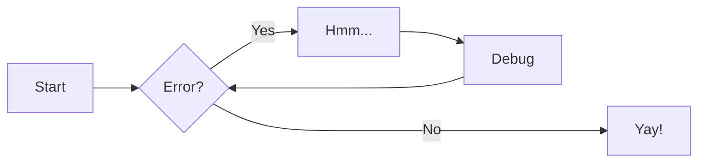
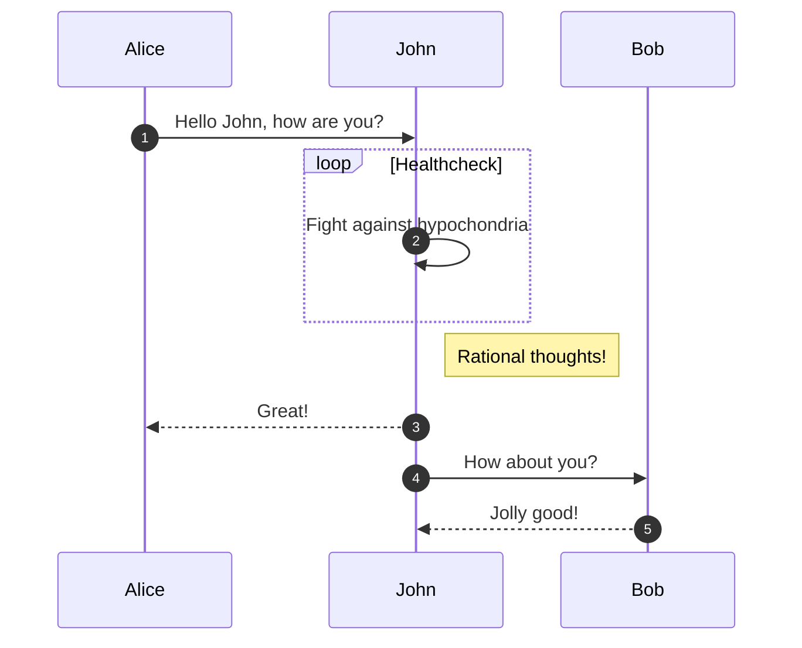

# Welcome to the PyTexas Conference Documentation

This site is built on [mkdocs](https://www.mkdocs.org) and uses
the [mkdocs-material](https://squidfunk.github.io/mkdocs-material/) theme.

We welcome contributions, however, since these are the runbooks used
for executing PyTexas, we reserve the right to reject PRs on the premise
that it is not how we do things.

If you are starting your own conference and want to use this as a
baseline for your operations feel free to fork!

## Developing Locally

1. Install dependencies in a virtual environment:

    ```
    pip install -r requirements.txt
    ```

1. You can run `mkdocs` in local dev mode by running:

    ```
    mkdocs serve
    ```

1. You can build out the full static site by running:

    ```
    mkdocs build
    ```

## Project layout

    mkdocs.yml    # The configuration file.
    docs/
        roles/        # Markdown pages describing the various roles
            conf-chair.md
            ...     
        runbooks/     # Markdown pages for the various tasks-based runbooks
            cfp.md
            ...
        dev.md        # Developer guide for contribution
        index.md      # The homepage.
        timeline.md   # A full, end-to-end, time-delineated list of tasks to be done and when
    overrides/
        partials/     # Customer overrides of the theme
            copyright.html # Added the Create Commons footer
    requirements.txt  # Python package requirements to build and dev this guide

## Extended Markdown Guide
This guide uses a few `pymdownx` extensions to render various
web elemnts.

### Details

```markdown
??? success
    Content.

??? warning classes
    Content.

???+ note "Open styled details"

    ??? danger "Nested details!"
        And more content again.
```

??? success
    Content.

??? warning classes
    Content.

???+ note "Open styled details"

    ??? danger "Nested details!"
        And more content again.


### Tabbed

```markdown
=== "Tab 1"
    Markdown **content**.

    Multiple paragraphs.

=== "Tab 2"
    More Markdown **content**.

    - list item a
    - list item b
```   

=== "Tab 1"
    Markdown **content**.

    Multiple paragraphs.

=== "Tab 2"
    More Markdown **content**.

    - list item a
    - list item b

### Diagrams with Mermaid

#### Flow Chard
```markdown
graph LR
  A[Start] --> B{Error?};
  B -->|Yes| C[Hmm...];
  C --> D[Debug];
  D --> B;
  B ---->|No| E[Yay!];
```



#### Sequence Diagram

```markdown
sequenceDiagram
  autonumber
  Alice->>John: Hello John, how are you?
  loop Healthcheck
      John->>John: Fight against hypochondria
  end
  Note right of John: Rational thoughts!
  John-->>Alice: Great!
  John->>Bob: How about you?
  Bob-->>John: Jolly good!
```





